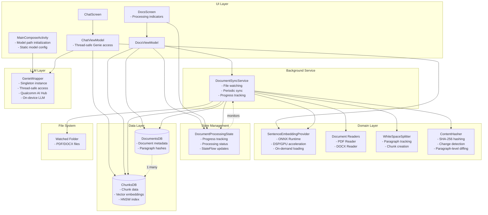
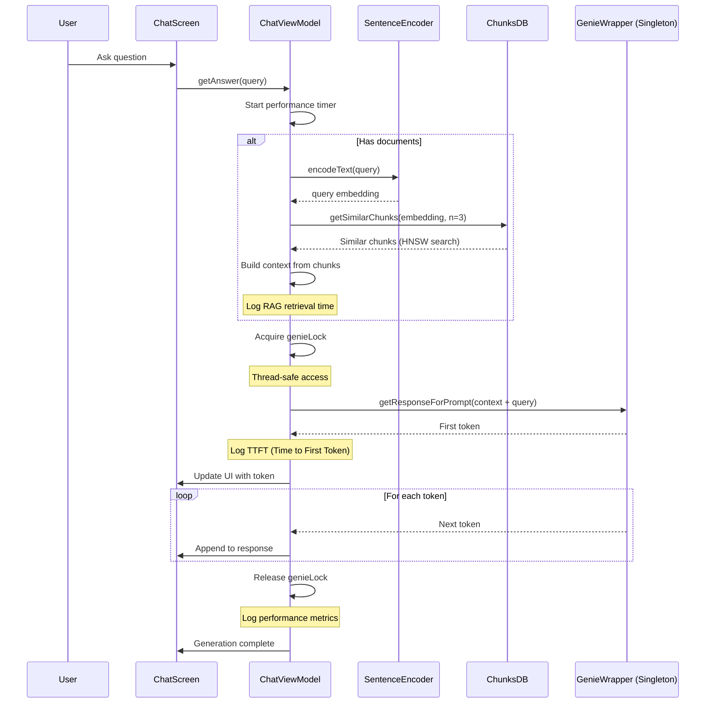
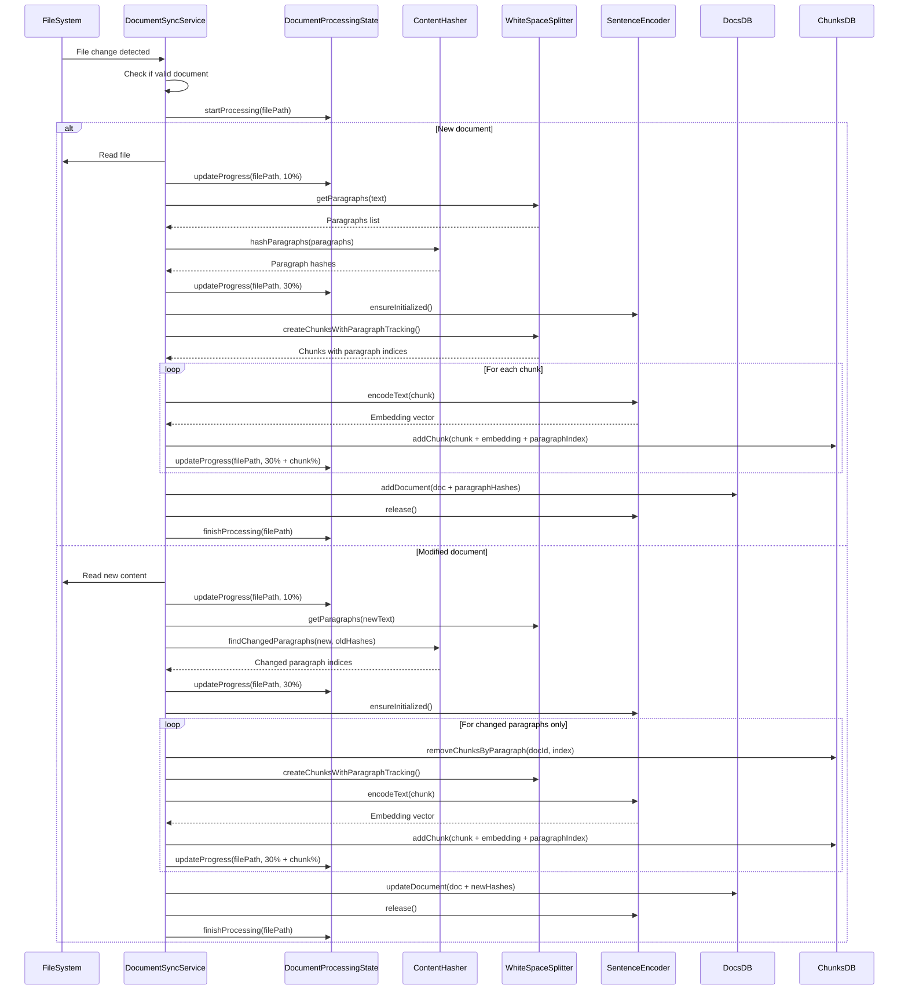
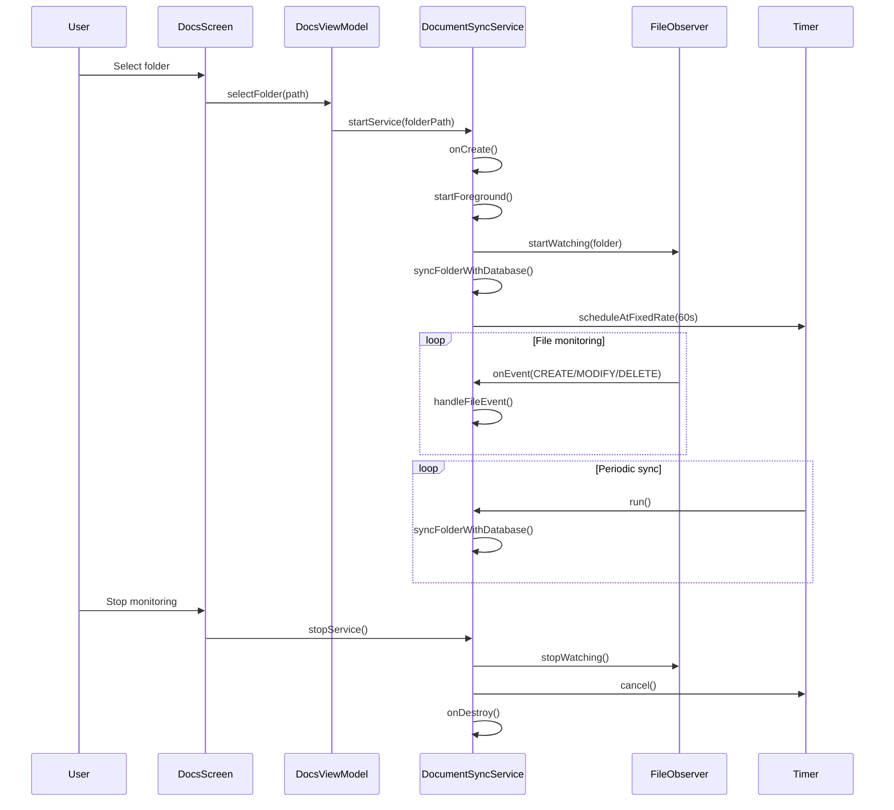
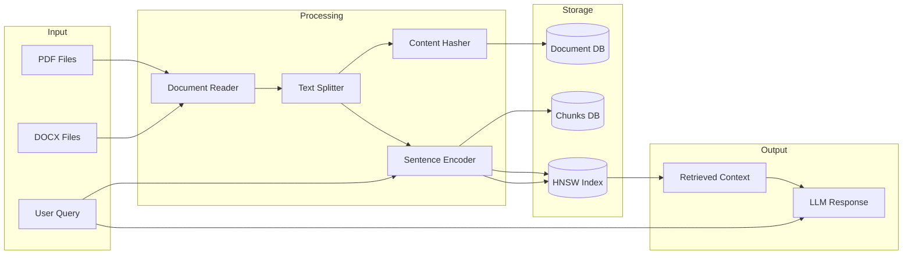

# System Architecture Diagrams

## System Component Architecture

## Sequence Diagram - Chat Query Flow

## Sequence Diagram - Document Processing Flow

## Sequence Diagram - Background Service Lifecycle

## Data Flow Diagram

## Key Features

### 1. Smart Chunking with Paragraph Hashing
- Documents split into paragraphs
- Each paragraph gets SHA-256 hash
- Only changed paragraphs re-processed on updates
- Preserves embeddings for unchanged content
- ContentHasher performs paragraph-level diffing

### 2. Resource Management
- GenieWrapper managed as singleton instance
- Thread-safe access via synchronized locks
- Sentence encoder (ONNX) loads on-demand
- Released after processing to free GPU/DSP
- Prevents memory exhaustion
- Model paths initialized statically in MainComposeActivity

### 3. Background Processing
- FileObserver watches for file changes
- Periodic sync every 60 seconds
- Runs as foreground service
- Real-time progress tracking via DocumentProcessingState
- Visual indicators for processing status in UI

### 4. Performance Metrics
- Time to First Token (TTFT)
- RAG retrieval time
- Total inference time
- Tokens per second
- End-to-end latency

### 5. Vector Search
- HNSW index for fast similarity search
- 384-dimensional embeddings
- Top-k retrieval for context

### 6. On-Device Processing
- All processing happens locally
- Uses Qualcomm DSP/GPU acceleration
- No cloud dependencies
- Optimized for Snapdragon 8 Gen2/Gen3/Elite SoCs